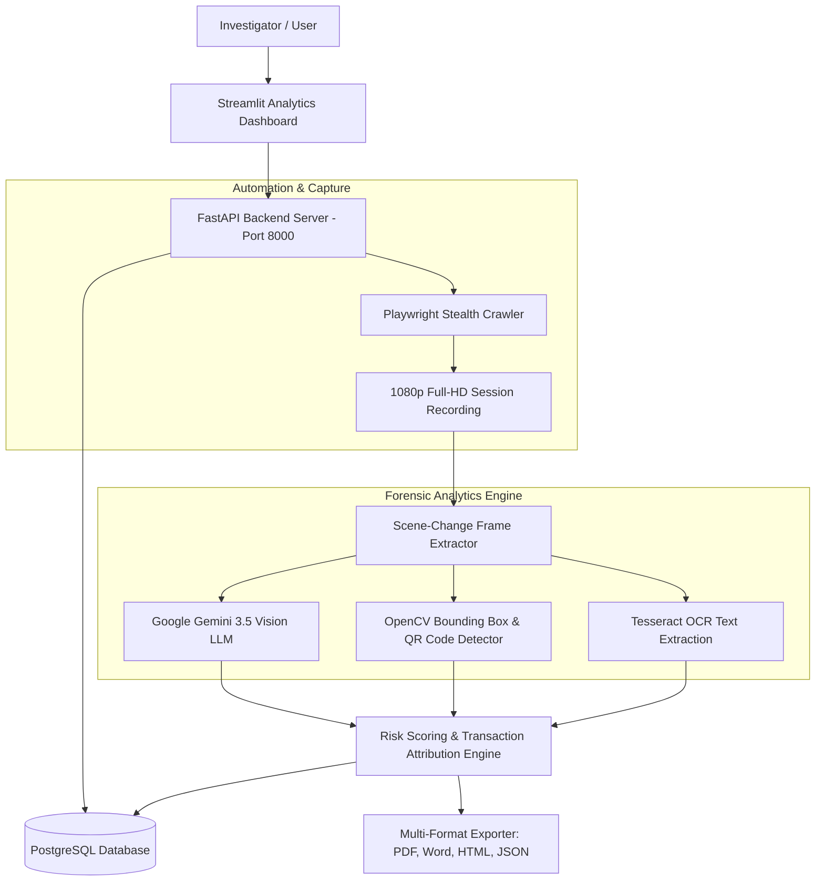

# 📘 Video Analysis & Automated Forensic Crawling Platform
## 📑 Comprehensive Manager & Technical User Guide

---

## Executive Summary

The **Video Analysis & Automated Forensic Crawling Platform** is an enterprise-grade digital forensics system designed to investigate, analyze, and document illegal online gambling, betting platforms, and financial fraud sites.

The platform combines **Playwright-stealth web crawling**, **automated 1080p screen recording**, **OpenCV computer vision & OCR**, **Google Gemini Vision LLM screenshot summarization**, and a **Streamlit analytical dashboard** with RESTful FastAPI endpoints.

---

## 🏗️ System Architecture & Core Stack



### Core Technologies Used:
- **Backend API:** FastAPI, Uvicorn, SQLAlchemy, PostgreSQL
- **Frontend Dashboard:** Streamlit, Plotly, HTML5/CSS3 Custom Components
- **Web Automation:** Python Async Playwright, `playwright_stealth`
- **Computer Vision & AI:** OpenCV, Tesseract OCR, PyZBar (QR Codes), Google Gemini 3.5 Vision LLM (`google-genai`)
- **Reporting Engine:** ReportLab (PDF), `python-docx` (Microsoft Word), Custom HTML5 Base64 Exporter

---

## 🚀 Prerequisites & Installation Guide

### 1. System Requirements
- **OS:** Linux (Ubuntu 22.04+ recommended), macOS, or Windows WSL2
- **Python:** Version 3.10 to 3.12
- **Database:** PostgreSQL (Running on `localhost:5432` or remote)
- **OCR Engine:** Tesseract OCR (`sudo apt install tesseract-ocr`)

### 2. Environment Setup
Clone the repository and set up the Python virtual environment:

```bash
cd video-analysis-dashboard

# Activate virtual environment
source venv/bin/activate

# Install dependencies (if setting up fresh)
pip install -r requirements.txt
playwright install chromium
```

### 3. Setting Up Google Gemini API Key
To enable AI-powered screenshot summaries, export your Gemini API key in your terminal session:

```bash
export GEMINI_API_KEY="AIzaSyYourActualGeminiApiKey"
```
*(Note: If no API key is provided, the platform automatically uses rule-based fallback summaries so execution never breaks.)*

---

## 🏃 How to Run the Platform

Launch the two core services in separate terminal tabs:

### Terminal 1: Launch FastAPI Backend Server
```bash
source venv/bin/activate
export GEMINI_API_KEY="AIzaSyYourActualGeminiApiKey"
uvicorn api:app --host 0.0.0.0 --port 8000 --reload
```
- **REST API Base URL:** `http://localhost:8000`
- **Interactive OpenAPI Documentation:** `http://localhost:8000/docs`

### Terminal 2: Launch Streamlit Analytical Dashboard
```bash
source venv/bin/activate
streamlit run dashboard.py --server.address 0.0.0.0 --server.port 8501
```
- **Dashboard Web UI:** `http://localhost:8501`

---

## 💻 Step-by-Step Usage Workflows

### Workflow A: Automated Web Crawling & Recording

1. Open the Streamlit Dashboard at `http://localhost:8501`.
2. In the **Sidebar Navigation**, select **"🌐 Automated Crawler & Live Capture"**.
3. **Enter Target URL:** Input the target website address (e.g. `https://cricway.bet`).
4. **Credentials & OTP Handling:**
   - The crawler automatically matches domain names against `rules/seed_accounts.csv`.
   - If the site requires Two-Factor Authentication (OTP), the crawler will pause asynchronously and prompt the user in the Streamlit UI to enter the OTP code received on SMS/WhatsApp.
5. Click **"🚀 Start Automated Crawl & Video Recording"**.
6. The Playwright engine executes the 4-phase forensic crawl:
   - **Phase 1: Authentication & Login**
   - **Phase 2: Context & Game Lobby Exploration**
   - **Phase 3: Affiliate & MLM Profile Scraping**
   - **Phase 4: Financial Gateway & QR Code Generation**
7. Once finished, the session video is recorded, saved, and automatically sent to the analysis pipeline.

---

### Workflow B: Manual Video Upload & Analysis

1. Go to the dashboard sidebar and choose **"📤 Direct Video Upload"**.
2. Select any screen recording video file (`.mp4`, `.webm`, `.avi`).
3. Click **"Run Forensic Analysis Pipeline"**.
4. The system executes:
   - **Frame Extraction:** Detects significant visual scene changes.
   - **Bounding Box Annotation:** Highlights detected payment terms, deposit CTAs, and UPI QR codes.
   - **AI Vision Analysis:** Google Gemini analyzes key proof frames to explain UI components.
   - **Risk Scoring:** Computes Gambling Risk, Banking Risk, and Cryptocurrency Risk percentages.

---

### Workflow C: Reviewing Analytics & Exporting Evidence

Navigate through the 5 Interactive Analytics Tabs:

1. **📊 Executive Intelligence Summary:**
   - High-level risk gauge meters (Gambling Score, Banking Score, Crypto Score).
   - Video metadata (duration, frame count, resolution, FPS).
2. **🔍 Segment Explorer:**
   - Frame-by-frame breakdown with annotated bounding boxes.
   - Displays **🤖 AI Forensic Screenshot Summaries** explaining each screen.
3. **💳 Transaction Funnel & Risk Attribution:**
   - Detailed breakdown of detected payment channels (UPI, Paytm, PhonePe, Bank Transfer, Crypto).
   - Beneficiary account numbers, IFSC codes, and UPI IDs extracted via OCR.
4. **📈 Sankey Flow & Gantt Timeline:**
   - Visual flow diagrams mapping user journey from Landing Page -> Game Lobby -> Cashier -> Deposit Execution.
5. **📥 Forensic Audit & Report Exports:**
   - Export court-admissible evidence packages in 4 formats:
     - 📄 **PDF Report (`.pdf`)**: Full visual report with AI summaries under proof frames.
     - 📝 **Word Document (`.docx`)**: Editable Microsoft Word report formatted for law enforcement submission.
     - 🌐 **HTML Web Report (`.html`)**: Interactive standalone web report with embedded base64 images.
     - 📊 **JSON Data Package (`.json`)**: Complete raw structured dataset.

---

## 🔌 API Integration Quick Reference

For developers and automated integrations, all features are exposed via REST API endpoints:

| Endpoint | Method | Description |
| :--- | :--- | :--- |
| `POST /crawl` | `POST` | Triggers 4-phase automated Playwright web crawl and video capture |
| `POST /analyses/upload` | `POST` | Uploads a video file for full forensic processing |
| `GET /analyses` | `GET` | Lists all historical analysis tasks |
| `GET /analyses/{task_id}/summary` | `GET` | Fetches complete analysis metrics, scores, and segments |
| `GET /analyses/{task_id}/export/{format}` | `GET` | Downloads report in `pdf`, `docx`, `html`, or `json` format |

Interactive API documentation with request/response testing is available at **`http://localhost:8000/docs`**.

---

## ⚙️ Maintenance & Seed Configuration

### Managing Seed Account Credentials
To store credentials for automated site logins, update `rules/seed_accounts.csv`:

```csv
Url,Username,Password,OTP (Y/N),Mobile Number
https://cricway.bet,shinchanchan,Password123,No,9876543210
```

---

## 📞 Support & Verification Checklist

Before presenting to management, verify the following:
- [x] PostgreSQL database is running (`sudo service postgresql status`)
- [x] FastAPI server running on port 8000 (`http://localhost:8000/docs`)
- [x] Streamlit UI running on port 8501 (`http://localhost:8501`)
- [x] `GEMINI_API_KEY` exported in terminal environment
- [x] Test report exports generated (`.pdf`, `.docx`, `.html`, `.json`)
